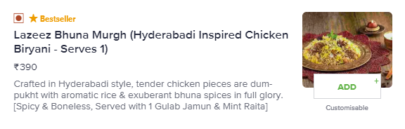
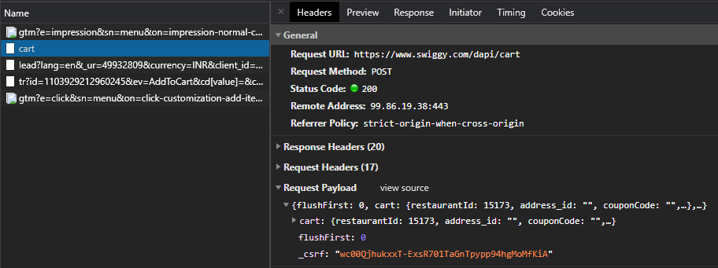
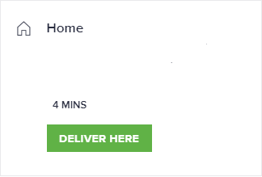

# swiggy-order

I can't cook. It is a craft that needs patience, creativity and time. I am very short on time and no amount of youtube training yields the same taste that money can buy. That clears a part of this project's goal - _buying food_. 

_but why write code? aren't there apps already working hard for it?_
Yes, they are working too hard and they are damn good at their job. I am trying to keep myself fit since 2nd November 2019, a day when I woke up with a pain so sharp in my back that I felt I wouldn't stand up again. Luckily, it wasn't that bad but it hurt for weeks. I promised myself never again. That meant quitting a lifestyle of having desserts 3X a day and not working out at all. 

I started training for MMA and that somehow took care of my sugar cravings. I could easily avoid desserts and feel nothing, no cravings, no regrets. 23rd March 2020, India annouced a lockdown to prevent the spread of covid19. This meant I had to train at home and that wasn't supposed to work (No sparring no fun). I noticed I was getting tempted every once in a while and ordering slices of cakes with ice creams and shakes. I knew where this was headed.

I have tried uninstalling swiggy and in no more than 3 days I install it back. If I could tell the app to not recommend certain items, I could make that work too. Since that isn't the case. I made this. If this helps you; continue using it, you owe me nothing. It is just a bunch of API integrations.

## Thought Process
- I decided to keep a list of my healthy buys and set this project to protect myself from my gluttony. 
- Integrate apis so that ordering food can happen via terminal and I don't have to browse. An additional plus is browsing can take 10 - 15 minutes without bringing any difference in my choices.
- Set up Swiggy money with a monthly quota so that I don't burn through my pocket.

## Installation and Usage
```
pip install swiggy-order
poetry run order-food --config=config.json [--coupon-code=<?>] [--log-level=DEBUG]
```

## Config
A very minimal `config.json` example:
```
{
  "registered_phone":"<10-digit-phone-number>",
  "address_id":"<address-id>",
  "menu":[
    {
      "name":"<However you want to remember a dish>",
      "payload":{...}
    }]
}
```

### Payload
An example payload looks like this:
```
{
    "flushFirst":0,
    "cart":{
        "restaurantId":<int>,
        "address_id":"<str>",
        "couponCode":<str>,
        "cartItems":[
        {
            "addons":[
            
            ],
            "variants":[
            
            ],
            "menu_item_id":<int>,
            "quantity":<int>
        }
        ],
        "mealItems":[
        
        ],
        "subscriptionItems":[
        
        ]
    },
    "_csrf": <str> # this is managed by this project, you can leave it empty or let it have its value when copied. The project will set it right.
    }
}
```
This can be obtained via opening the network tab and monitoring the response for the `POST` requests on `https://www.swiggy.com/dapi/cart` API, when an item is selected from the menu and it shows up in the cart. The reason for copying the payload is to prevent code changes if the API structure / restaurant-ids / menu-item-ids / ??? were to change. The open sourced nature of this tool means fixing such issues is a matter of PRs but it didn't occur to me as time well spent. None of the changes I can forsee would be frequent, so changing the `config.json` seems to be much more time efficient than changing the code.



Payload appears after clicking the ADD button


Payload for adding this dish from behrouz biryani to your cart 🍛. You can add an entry in `config.json` as:

```
{
    ...
    "menu": [{
        "name": "biryani boneless",
        "payload": <PASTE_HERE>
    }]
}
```
Once added you can retain the items in a list.

### Address
`address_id` can be found through the web-interface, monitor the response for the `POST` requests on `https://www.swiggy.com/dapi/cart` API when trying to click the "DELIVER HERE" button, post the checkout phase. 🗺



Address updates after clicking the DELIVER HERE button 👆


Notice the updated value of `address_id`. This can be kept within `config.json`, should be a one time addition.

### Payment Method
Currently, this project assumes that payments are made via swiggy money only. I didn't want to solve for every payment method, those would anyway require callbacks to ensure safety. That is a lot of work and somehow there is a server someone needs to maintain. 💳💸

## Fin
Eat well my friends. It will show as you age, I can already feel the difference from my 20s and I am not even 30 yet.
